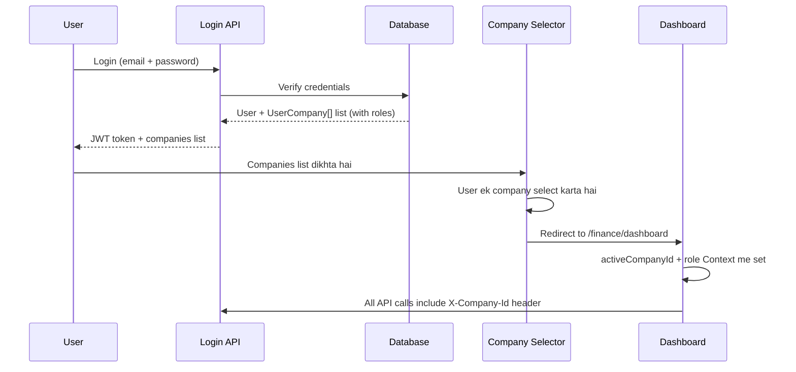
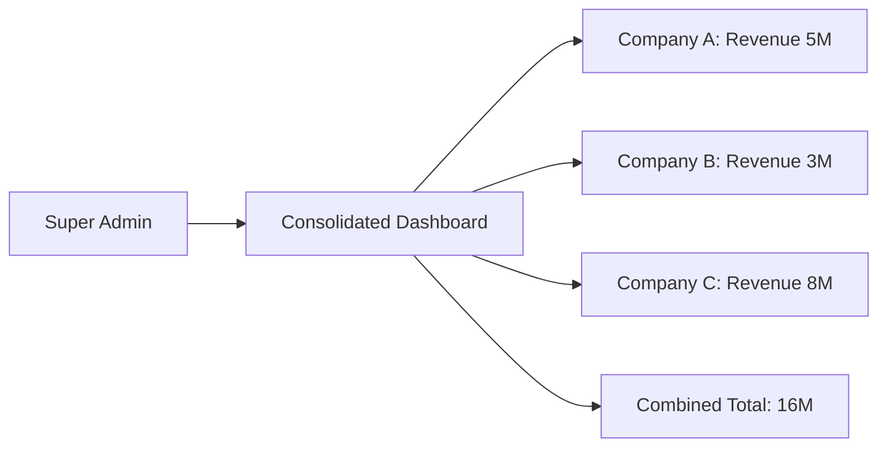
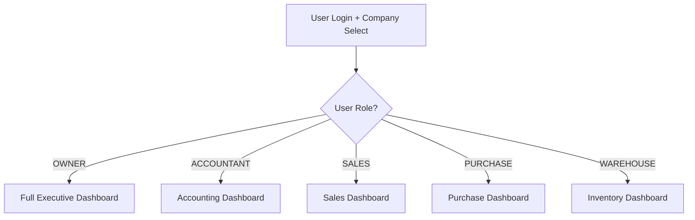

# Multi-Company Support — Implementation Plan

## Overview

Row-Level Tenancy approach: har table me `companyId` add karo. Har company ka data completely separate rehega — COA, Users, RBAC, Sale/Purchase, Voucher Serial Numbers, Fiscal Year — sab kuch alag.

---

## Phase 1: Schema Changes

### 1A. New Models — UserCompany (Multi-Company Access)

```prisma
model UserCompany {
  id        String   @id @default(uuid())
  userId    String
  companyId String
  role      String   @default("USER")  // OWNER, ADMIN, USER
  isDefault Boolean  @default(false)
  createdAt DateTime @default(now())
  updatedAt DateTime @updatedAt
  user      User     @relation(fields: [userId], references: [id])
  company   Company  @relation(fields: [companyId], references: [id])

  @@unique([userId, companyId])
}
```

### 1B. Add `companyId` to ALL Models

| Model | Current | Change |
|-------|---------|--------|
| `Account` | ✅ Has companyId | No change needed |
| `Transaction` | ✅ Has companyId | No change needed |
| `Product` | ❌ Global | Add `companyId` + `@@unique([companyId, code])` |
| `Category` | ❌ Global | Add `companyId` |
| `Customer` | ❌ Global | Add `companyId` + `@@unique([companyId, code])` |
| `Supplier` | ❌ Global | Add `companyId` + `@@unique([companyId, code])` |
| `Warehouse` | ❌ Global | Add `companyId` + `@@unique([companyId, code])` |
| `FinancialYear` | ❌ Global | Add `companyId` + `@@unique([companyId, name])` |
| `JournalEntry` | ❌ Global | Add `companyId` + `@@unique([companyId, number])` |
| `StockLedger` | ❌ Global | Add `companyId` |
| `VoucherSequence` | ❌ Global | Add `companyId` + `@@unique([companyId, type])` |
| `PurchaseOrder` | ❌ Global | Add `companyId` + `@@unique([companyId, poNo])` |
| `GRN` | ❌ Global | Add `companyId` + `@@unique([companyId, grnNo])` |
| `PurchaseInvoice` | ❌ Global | Add `companyId` + `@@unique([companyId, invoiceNo])` |
| `PurchaseReturn` | ❌ Global | Add `companyId` + `@@unique([companyId, returnNo])` |
| `SalesQuotation` | ❌ Global | Add `companyId` + `@@unique([companyId, quoteNo])` |
| `SalesOrder` | ❌ Global | Add `companyId` + `@@unique([companyId, orderNo])` |
| `DeliveryOrder` | ❌ Global | Add `companyId` + `@@unique([companyId, doNo])` |
| `SalesInvoice` | ❌ Global | Add `companyId` + `@@unique([companyId, invoiceNo])` |
| `SalesReturn` | ❌ Global | Add `companyId` + `@@unique([companyId, returnNo])` |
| `AuditLog` | ❌ Global | Add `companyId` |
| `GlobalSetting` | ❌ Global | Rename → `CompanySetting` + Add `companyId` |
| `TaxCode` | ❌ Global | Add `companyId` + `@@unique([companyId, code])` |

| `Unit` | ❌ Global | Add `companyId` + `@@unique([companyId, code])` |
| `Currency` | ❌ Global | Add `companyId` + `@@unique([companyId, code])` |
| `UnitConversion` | ❌ Global | Add `companyId` |

> [!NOTE]
> Har company apni nature ke hisab se apne Units, Currencies, aur Conversions rakhegi — sab per-company.

### 1C. Data Migration Script

Existing data ko ek "Default Company" assign karna hoga:

```sql
-- Step 1: Create default company (if not exists)
-- Step 2: UPDATE Product SET companyId = '<default-company-id>';
-- Step 3: UPDATE Customer SET companyId = '<default-company-id>';
-- ... (all tables)
-- Step 4: Drop old unique constraints, add new compound ones
```

---

## Phase 2: Auth & Company Selection

### Login Flow

Auth ek hi rehega — jab user login karega, uski assigned companies show hongi. Jo company select karega, us ke dashboard pe redirect ho jayega.



> [!IMPORTANT]
> Agar user ki sirf **1 company** hai to company selector skip ho jayega — direct dashboard pe redirect.

### Changes
- **JWT Token**: `userId` + `email` + `role` (no companyId in token — dynamic switch)
- **Frontend**: Login → Company Selector Page → Dashboard
- **API Middleware**: Extract `X-Company-Id` header + verify user has access to that company
- **CompanyContext**: React Context to store active company

---

## Phase 3: Service Layer Changes

Har service me `companyId` parameter add + har query me filter:

```diff
// account.service.ts
- static async getAccountHierarchy() {
-   const allAccounts = await prisma.account.findMany({...});
+ static async getAccountHierarchy(companyId: string) {
+   const allAccounts = await prisma.account.findMany({
+     where: { companyId },
+     ...
+   });

// voucher.service.ts
- static async generateNumber(type: VoucherType, tx?) {
-   let sequence = await txClient.voucherSequence.findUnique({ where: { type } });
+ static async generateNumber(companyId: string, type: VoucherType, tx?) {
+   let sequence = await txClient.voucherSequence.findFirst({
+     where: { companyId, type }
+   });

// financial-year.service.ts  
- static async getActiveYear(date?) {
+ static async getActiveYear(companyId: string, date?) {
+   // filter by companyId

// purchase.service.ts, sales.service.ts  
// Har create/list method me companyId add
```

Services to modify: **`account`, `voucher`, `financial-year`, `purchase`, `sales`, `report`, `stock`, `product`, `party`, `category`, `warehouse`, `journal`, `settings`, `closing`, `tax`, `rbac`, `audit`**

---

## Phase 4: API Routes Update

- Har API route `X-Company-Id` header se companyId extract karega
- Middleware me verify karega ki user ko is company ka access hai
- Service calls me companyId pass karega

```typescript
// Helper function for all API routes
function getCompanyId(req: Request): string {
  const companyId = req.headers.get('x-company-id');
  if (!companyId) throw new Error('Company not selected');
  return companyId;
}
```

---

## Phase 5: Frontend Changes

| Component | Change |
|-----------|--------|
| **CompanyContext** | New React Context — stores `activeCompanyId` |
| **CompanySelectorPage** | Login ke baad company select karne ka page |
| **Sidebar** | Active company name show + switch button |
| **API Client** | `X-Company-Id` header auto-inject |
| **All Forms** | Company data se related dropdowns filter by company |

### Voucher Settings UI (Per Company)
- Admin Panel me har VoucherType ka **prefix** aur **next serial** set karne ka UI
- Har company ke liye alag voucher numbering

---

## User & RBAC Management Architecture

| Feature | Where | Managed By |
|---------|-------|------------|
| **User CRUD** | 🌐 Global Admin Panel | Super Admin |
| **Company CRUD** | 🌐 Global Admin Panel | Super Admin |
| **User ↔ Company assign** | 🌐 Global Admin Panel | Super Admin |
| **Role/RBAC per company** | 🏢 Inside Company → Settings | Company Admin |

**Flow**: Super Admin globally user banata hai → company assign karta hai → Company Admin (ya Super Admin) us company ke andar permissions set karta hai.

---

## Phase 6: Admin Panel

### 6A. Global Admin Panel (Super Admin only)
| Feature | Description |
|---------|-------------|
| User CRUD | Create, edit, deactivate users |
| Company CRUD | Create, edit, delete companies |
| Auto-setup COA | Naye company pe automatic default COA tree |
| Assign User → Company | User ko company me add + initial role |

### 6B. In-Company Settings (Company Admin)
| Feature | Description |
|---------|-------------|
| User Roles | Company ke andar user ki role/permissions set |
| Voucher Settings | Per-company prefix + serial number config |
| Financial Year | Company ki fiscal year manage |
| Company Settings | Currency, address, logo, etc. |

---

## Phase 7: Consolidated Reports (Super Admin Only)

Sirf **main user / Super Admin** ko dikhenge — jis ke paas sab companies ka access hai.

| Report | Description |
|--------|-------------|
| **Combined Trial Balance** | Sab companies ka combined TB |
| **Combined P&L** | Sab companies ka combined Profit & Loss |
| **Combined Balance Sheet** | Sab companies ka combined BS |
| **Company-wise Summary** | Har company ka revenue, expense, profit side by side |
| **Sales/Purchase Summary** | Cross-company sales/purchase totals |

> [!IMPORTANT]
> Access Control: Sirf un companies ka data show hoga jin ka user ko access hai. Super Admin ko sab dikhega.



---

## Phase 8: Company-Level Backup & Restore

| Feature | Description |
|---------|-------------|
| **Export Company** | Company ka sara data JSON/SQL dump me export — COA, Products, Customers, Invoices, Stock, Vouchers, Settings |
| **Import/Restore** | Exported backup se naya company restore ya existing me overwrite |
| **Selective Export** | Sirf master data (COA, Products, Customers) ya full data |
| **Download** | Super Admin download kar sakta hai |

### Backup Scope (Per Company)
```
📦 Company Backup
├── 📊 Chart of Accounts (full tree)
├── 📦 Products + Variants
├── 👥 Customers + Suppliers
├── 🏭 Warehouses
├── 📋 All Purchase Documents (PO, GRN, Invoice, Return)
├── 📋 All Sales Documents (Quote, SO, DO, Invoice, Return)
├── 📒 Journal Entries + Lines
├── 📈 Stock Ledger
├── ⚙️ Voucher Sequences + Settings
└── 📅 Financial Years
```

> [!WARNING]
> Restore operation will be **destructive** — existing company data replace ho jayega. Confirmation dialog mandatory.

---

## Phase 9: Role-Based Dashboards

Har user ko uski **role ke mutabiq alag dashboard** dikhega. Ek company me OWNER ko aur dikhega, SALES person ko aur.

| Role | Dashboard Widgets |
|------|------------------|
| **OWNER / SUPER_ADMIN** | Full overview: Revenue, P&L, Cash Flow, Receivable/Payable, Top Customers, Recent Activity |
| **ADMIN** | Revenue summary, User activity, Pending approvals |
| **ACCOUNTANT** | Trial Balance snapshot, Pending vouchers, Journal entries today, Unreconciled items |
| **SALES** | Sales today, Pending orders, Top customers, Quotation conversion rate |
| **PURCHASE** | Purchase summary, Pending POs, GRN today, Supplier balances |
| **WAREHOUSE** | Stock summary, Low stock alerts, Recent GRNs/DOs, Stock movement |



> [!NOTE]
> Dashboard widgets configurable bhi ho sakte hain future me — user apne widgets drag/drop kar sake.

---

## Phase 10: Extra Features

### 10A. Company Template / Clone
- Naya company banate waqt **existing company se copy** kar sako: COA, Products, Tax Codes, Units
- Har baar manually setup na karna pade

### 10B. Enhanced Activity Log
- Har action me `companyId` + `userId` log
- Kaun kab kaunsi company me kya kiya — full audit trail
- Company ke andar activity log page

### 10C. Quick Company Switch
- Sidebar me **company switcher dropdown** — bina logout kiye company change
- Smooth transition, data reload hoga silently

### 10D. Prisma Safety Middleware
- Automatic `companyId` injection on every query
- Developer galti se filter miss kare to bhi data leak na ho
- Extra security layer

### 10E. Company Selector Dashboard Cards
- Company select page pe har company ka **quick stats** dikhein
- Revenue, Receivable, Payable, Last Active

---

## Verification Plan

### Automated Tests
- `npx prisma migrate dev` — schema migration successful
- Data migration script — existing data correctly assigned
- Login → Company selector → Dashboard flow

### Manual Verification  
- Create 2 companies → verify data isolation
- User switch between companies → COA/Products/Invoices different
- Voucher serial numbers independent per company
- Same product code allowed in different companies
- Consolidated report shows combined data for super admin
- Backup export → restore in new company → data matches
- Different roles see different dashboards
- Quick company switch works without logout
- Prisma middleware blocks queries without companyId

---

## Estimated Effort

| Phase | Work | Days |
|-------|------|------|
| Phase 1 | Schema + Migration | 2 |
| Phase 2 | Auth + Company Selection | 2 |
| Phase 3 | Service Layer (17+ services) | 3-4 |
| Phase 4 | API Routes | 1-2 |
| Phase 5 | Frontend (Context + UI) | 2-3 |
| Phase 6 | Admin Panel (Global + In-Company) | 1-2 |
| Phase 7 | Consolidated Reports | 2-3 |
| Phase 8 | Backup & Restore | 1-2 |
| Phase 9 | Role-Based Dashboards | 2-3 |
| Phase 10 | Extra Features | 2-3 |
| **Total** | | **~18-25 days** |
